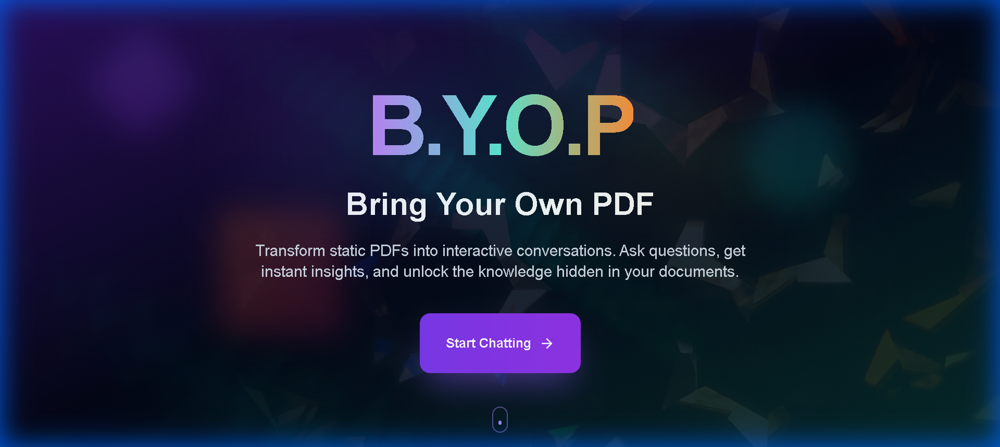
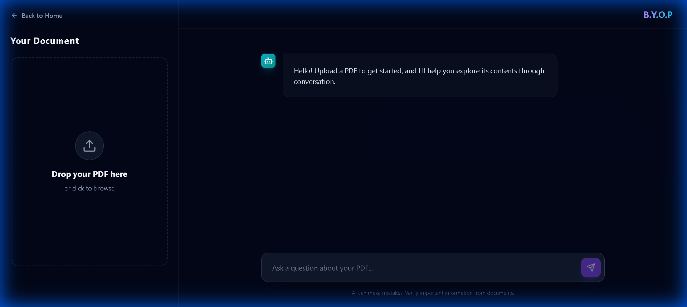

# B.Y.O.P (Bring Your Own PDF)

B.Y.O.P is a modern, full-stack application that transforms static PDF documents into interactive conversations. By leveraging the power of Spring AI and React, users can upload their documents and chat with them in real-time, asking questions and receiving accurate, context-aware answers.



## 🚀 Features

### Core Functionality
- **PDF Ingestion & Analysis**: Seamlessly simple upload process that reads, chunks, and embeds PDF content for AI retrieval.
- **Interactive Chat**: Real-time conversation interface to query your documents.
- **RAG Architecture**: Uses Retrieval Augmented Generation to ground AI responses in your actual document content.

### Modern UI/UX
- **Responsive Design**: Built with TailwindCSS for a seamless experience across devices.
- **Glassmorphism Aesthetics**: sleek, modern interface with transparency and blur effects.
- **Rich Text Rendering**: Chat responses support Markdown formatting (bold, lists, code blocks) using `markdown-to-jsx`.
- **Dynamic Feedback**: Real-time status updates for file uploads and processing.



## 🛠️ Tech Stack

### Frontend
- **Framework**: React 19 (via Vite)
- **Styling**: TailwindCSS, Vanilla CSS (custom animations)
- **Icons**: Lucide React
- **Routing**: React Router DOM v7
- **HTTP Client**: Axios
- **Markdown**: markdown-to-jsx (Rich text rendering)

### Backend
- **Framework**: Spring Boot 3.5.9
- **AI Integration**: Spring AI 1.1.2
- **Model Provider**: Google Generative AI (Gemini)
- **Vector Store**: In-Memory SimpleVectorStore (for demo purposes)
- **PDF Parsing**: Spring AI PagePdfDocumentReader

## 🏗️ Architecture

1.  **Upload**: User uploads a PDF via the React frontend.
2.  **Processing**: backend accepts the file, parses it using `PagePdfDocumentReader`.
3.  **Embedding**: The text is split into chunks and converted into vector embeddings.
4.  **Storage**: Embeddings are stored in the local Vector Store.
5.  **Retrieval**: When a user asks a question, the system searches the Vector Store for relevant chunks.
6.  **Generation**: The relevant context + user question is sent to the AI model to generate a precise answer.

## 🔧 Setup & Installation

### Prerequisites
- Java 21+
- Node.js 18+
- Maven
- Google AI API Key

### Backend Setup
1.  Navigate to the project root.
2.  Configure your API key in `src/main/resources/application.properties`:
    ```properties
    spring.ai.google.genai.api-key=YOUR_API_KEY
    ```
3.  Run the application:
    ```bash
    ./mvnw spring-boot:run
    ```
    The backend will start on `http://localhost:8080`.

### Frontend Setup
1.  Navigate to the `frontend` directory:
    ```bash
    cd frontend
    ```
2.  Install dependencies:
    ```bash
    npm install
    ```
3.  Start the development server:
    ```bash
    npm run dev
    ```
    The frontend will run on `http://localhost:5173`.

## 🔄 Recent Updates

- **Enhanced Markdown Support**: Switched to `markdown-to-jsx` for stable, crash-free rendering of lists and rich text in chat.
- **UI Improvements**: Fixed z-index layering issues on the upload button and refined success messages to include filenames.
- **Backend Optimizations**: Aligned prompt template variables to ensure accurate context injection.

## 📝 API Endpoints

- `POST /api/upload`: Uploads and processes a PDF file.
- `POST /api/chat`: Sends a message and retrieves context-aware responses.

---
*Built as a demonstration of Spring AI capabilities paired with a modern React frontend.*
